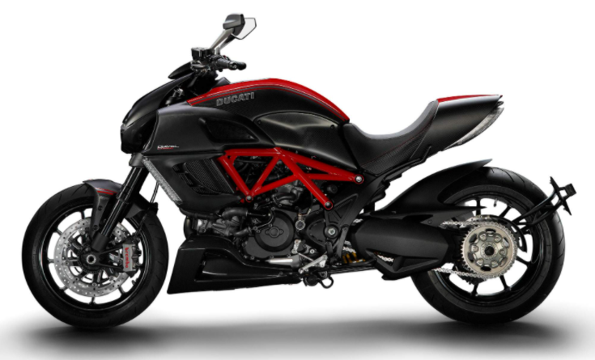

# 2012 Ducati Diavel Carbon
### Maintenance log and parts/upgrades tracking for my current ride.

- bought on `12.11.2020` for `$8,400` with `5,649` miles
- VIN: `ZDM13BLW3CB005892`
- engine #: `3BLC005891`
- license plate #: `20P8963`
- registration: `Aug 2021`
- gas: `91+` octane
- oil: SAE `15W-50`
- tires:
  - front: `120/70-ZR17`
  - rear: `240/45-ZR17`
  - PSI: `36` for both front and rear (`38` with a passenger)

*****

| Service              | Date       | Mileage    | Price      | Notes            |
| :------------------- | :--------: | :--------: | :--------- | :--------------- |
| engine oil & filter  | 06.20.2021 | 7,500      |            | KN-153           |
| air filter           |            |            |            |                  |
| brake pads - F       |            |            |            |                  |
| brake pads - R       |            |            |            |                  |
| brake fluid          |            |            |            |                  |
| clutch fluid         |            |            |            |                  |
| coolant              |            |            |            |                  |
| battery              |            |            |            |                  |
| spark plugs          |            |            |            |                  |
| valve adjustment     |            |            |            |                  |
| chain clean/wax      | 01.10.2021 | 6,200      |            |                  |

*****

| Part                 | Date       | Mileage    | Price      | Notes            |
| :------------------- | :--------: | :--------: | :--------- | :--------------- |
| bar end mirrors      | 12.17.2020 | 5,700      | $20        | ebay             |
| frame sliders        | 12.17.2020 | 5,700      | $150       | satoracing.com   |
| axle sliders - F     | 12.17.2020 | 5,700      | $60        | satoracing.com   |
| axle sliders - R     | 12.17.2020 | 5,700      | $65        | satoracing.com   |
| stand                | 01.05.2020 | 6,150      | $155       | t-rex-racing.com |
| touring seat         | 01.18.2021 | 6,300      | $270       | pure-ducati.com  |
| engine covers        |            |            |            |                  |
| windscreen           |            |            |            |                  |
| passenger back rest  |            |            |            |                  |
| fender eliminator    |            |            |            |                  |
